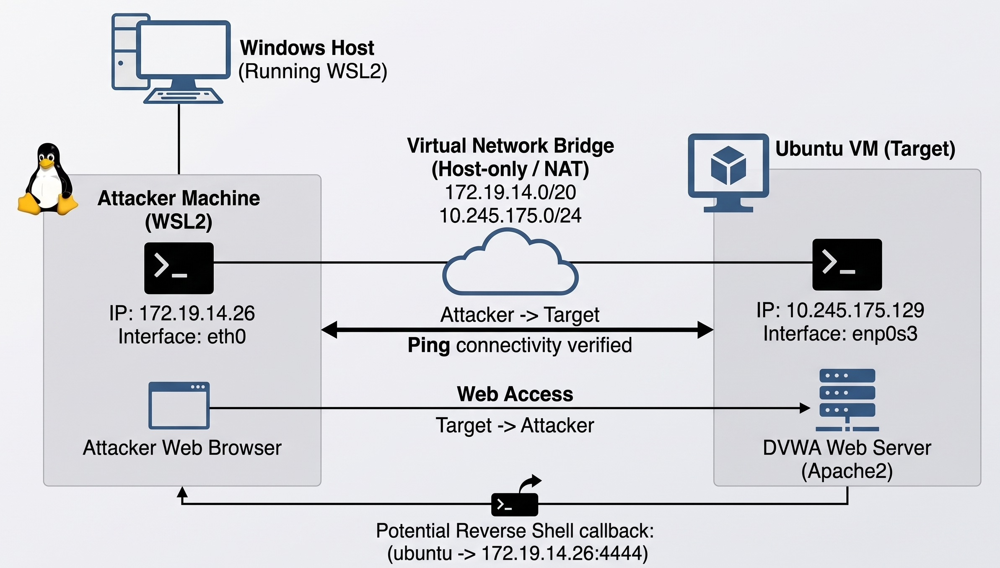
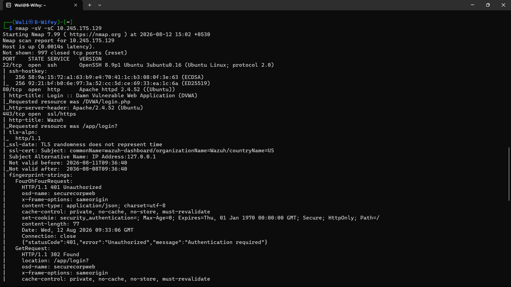
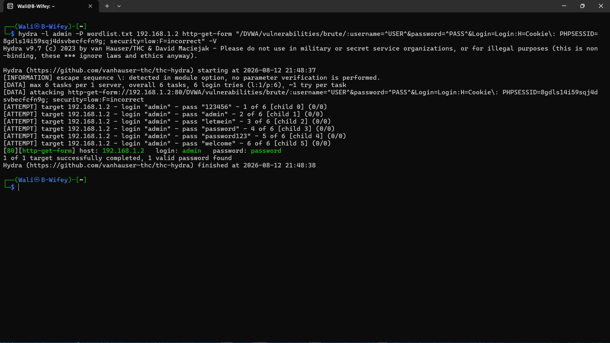
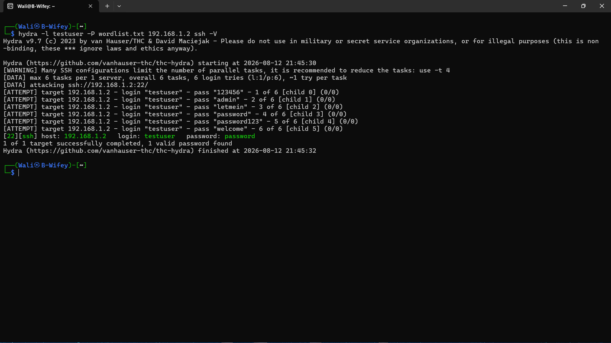
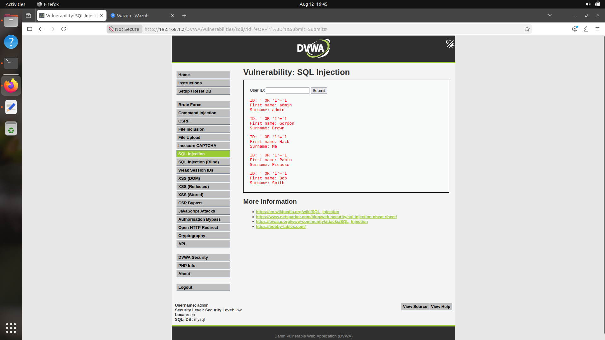
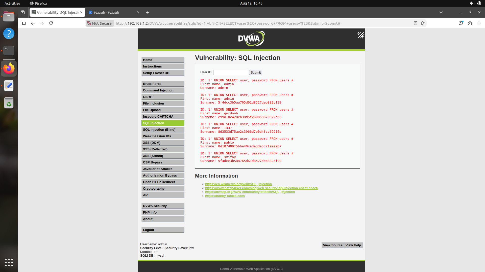
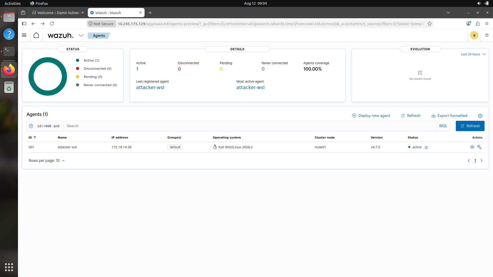
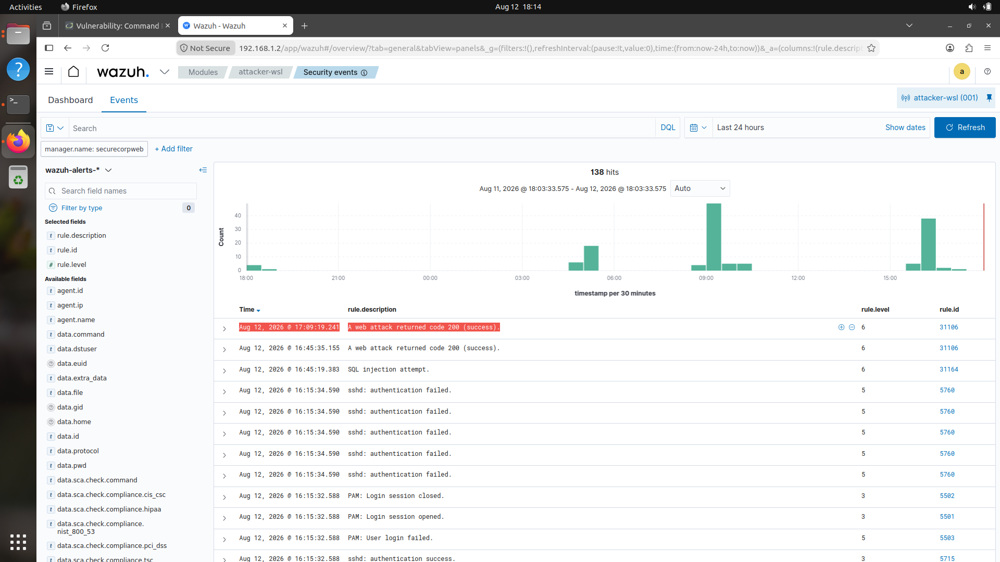
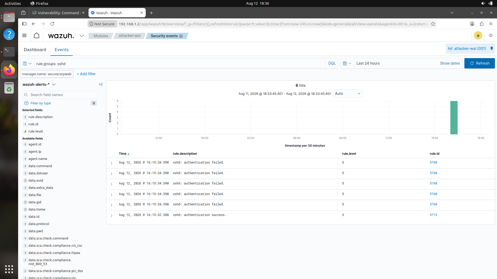

# 🛡️ Web Application Security Assessment & SIEM Monitoring

**Author:** BAGATHEESHWAR A  
**Domain:** Cyber Security  
**Organization:** Aenexz Tech  


---

## 📝 Project Overview

This project simulates a **full-cycle penetration test** followed by a **Blue Team incident investigation** for a fictional client, *SecureCorp*. The engagement involved actively exploiting a vulnerable web application (DVWA) and a Linux host, then investigating those exact attacks using the **Wazuh SIEM** platform to formulate actionable security recommendations — covering the complete offense-to-defense lifecycle.

---

## 🏗️ Architecture & Topology

| Component | Details |
|---|---|
| **Target Environment** | Ubuntu Linux VM (`192.168.1.2`) hosting Apache2, PHP, and MariaDB |
| **Vulnerable Application** | Damn Vulnerable Web Application (DVWA) |
| **Attacker Machine** | Kali Linux / WSL2 (`172.19.14.26`) |
| **SIEM / SOC Platform** | Wazuh Open Source Security Platform (Agent v4.7.5) |

<p align="center">
  
  <br><em>Figure 1: Lab Architecture & Attack Topology</em>
</p>

---

## ⚔️ Phase 1 — Red Team Operations (Attack Simulation)

Simulated real-world threat vectors against the target infrastructure, documenting payloads, methods, and execution timelines.

### 1. Network Reconnaissance & Port Scanning
* **Execution:** Scanned target host `192.168.1.2` using Nmap service detection.
* **Result:** Identified open ports including `22/tcp` (SSH) and `80/tcp` (HTTP Apache).

<p align="center">
  
</p>

### 2. Credential Brute-Forcing (SSH & Web)
* **Web Login Brute-Force:** Executed `Hydra` against DVWA HTTP-GET form with active session cookies, cracking the `admin` account password (`password`).
* **SSH Password Attack:** Performed targeted dictionary attack against the target SSH service.

<p align="center">
  
  <br>
  
</p>

### 3. Web Application Exploitation (SQLi & Command Injection)
* **SQL Injection (Logic Bypass):** Injected `' OR '1'='1` into user search field to bypass application logic and extract all stored user profiles.
* **SQL Injection (Data Exfiltration):** Injected `1' UNION SELECT user, password FROM users #` to dump database credentials and MD5 password hashes.
* **Command Injection:** Executed OS-level commands through DVWA ping utility.

<p align="center">
  
  <br>
  
</p>

---

## 🛡️ Phase 2 — Blue Team Operations (Detection & Investigation)

Transitioned to a SOC Analyst role to verify telemetry, investigate attack traces, and correlate security events within **Wazuh SIEM**.

### 1. Endpoint & Telemetry Overview
* **Agent Tracking:** Monitored active agent `attacker-wsl` (`172.19.14.26`) forwarding security events to Wazuh Manager.

<p align="center">
  
</p>

### 2. Log Analysis & Threat Detection
* **SQL Injection Alerts:** Triggered **Rule 31164** (*SQL injection attempt*, Severity 6) and **Rule 31186** (*Web attack returned code 200*).
* **SSH Brute-Force Sequence:** Correlated multiple instances of **Rule 5760** (*sshd: authentication failed*, Severity 5) followed by **Rule 5715** (*sshd: authentication success*, Severity 3).

<p align="center">
  
  <br>
  
</p>

---

## 🚀 Phase 3 — Remediation & Security Recommendations

Translated technical findings into a strategic remediation roadmap for client leadership:

1. **Web Application Defense:**
   * Implement **Parameterized Queries / Prepared Statements (PDO)** to neutralize SQL Injection vectors.
   * Secure session tokens by applying `HttpOnly` and `Secure` cookie attributes.
2. **Access Control & SSH Hardening:**
   * Disable SSH password authentication (`PasswordAuthentication no`) in favor of **ed25519 SSH key pairs**.
   * Deploy rate-limiting mechanisms like `Fail2ban` to prevent automated brute-force attacks.
3. **SIEM Tuning & Active Response:**
   * Configure Wazuh **Active Response** rules to automatically block IP addresses generating repeated authentication failures or web injection alerts.

---

## 📁 Repository Contents

```text
.
├── 1_Reports_and_Presentations/   # Executive reports, presentation slide decks, and diagrams
├── 2_Red_Team_Attack_Logs/        # Terminal outputs, payload logs, and attack artifacts
├── 3_Blue_Team_Evidence/          # Wazuh SIEM dashboards, alert logs, and correlation rules
└── 4_Evidence_Screenshots/        # Full uncropped visual evidence of target and services
